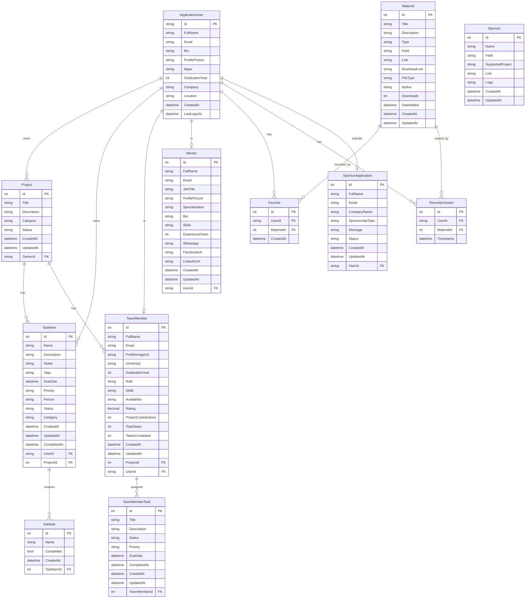

# GradLink Database ERD (Entity Relationship Diagram)

## 📊 Visual ERD (Mermaid)



---

## 📋 Table Details

### 1. **Projects** (المشاريع)
| Column | Type | Constraints | Description |
|--------|------|-------------|-------------|
| Id | int | PK, Auto | معرف المشروع |
| Title | string | Required | عنوان المشروع |
| Description | string | Nullable | وصف المشروع |
| Category | string | Nullable | تصنيف المشروع |
| Status | string | Default: "Active" | حالة المشروع |
| CreatedAt | datetime | Default: Now | تاريخ الإنشاء |
| UpdatedAt | datetime | Nullable | تاريخ التحديث |
| **OwnerId** | string | FK → ApplicationUser | صاحب المشروع |

**Relationships:**
- `1 User → Many Projects` (المستخدم يمكنه إنشاء عدة مشاريع)
- `1 Project → Many Tasks` (المشروع يحتوي على عدة مهام)
- `1 Project → Many TeamMembers` (المشروع يحتوي على عدة أعضاء)

---

### 2. **TaskItem** (المهام)
| Column | Type | Constraints | Description |
|--------|------|-------------|-------------|
| Id | int | PK, Auto | معرف المهمة |
| Name | string | Required | اسم المهمة |
| Description | string | Nullable | وصف المهمة |
| Notes | string | Nullable | ملاحظات إضافية |
| Tags | string | Nullable | كلمات مفتاحية (مفصولة بفاصلة) |
| DueDate | datetime | Nullable | تاريخ الاستحقاق |
| Priority | string | Default: "Medium" | الأولوية (Low/Medium/High) |
| Person | string | Nullable | الشخص المسؤول |
| Status | string | Default: "Pending" | الحالة |
| Category | string | Default: "Other" | التصنيف |
| CreatedAt | datetime | Default: Now | تاريخ الإنشاء |
| UpdatedAt | datetime | Nullable | تاريخ التحديث |
| CompletedAt | datetime | Nullable | تاريخ الإكمال |
| **UserId** | string | FK → ApplicationUser, Required | صاحب المهمة |
| **ProjectId** | int | FK → Project, Nullable | المشروع المرتبط |

**Relationships:**
- `1 User → Many Tasks` (المستخدم يمكنه إنشاء عدة مهام)
- `1 Project → Many Tasks` (المشروع يحتوي على عدة مهام)
- `1 Task → Many Subtasks` (المهمة تحتوي على مهام فرعية)

---

### 3. **Subtask** (المهام الفرعية)
| Column | Type | Constraints | Description |
|--------|------|-------------|-------------|
| Id | int | PK, Auto | معرف المهمة الفرعية |
| Name | string | Required | اسم المهمة الفرعية |
| Completed | bool | Default: false | حالة الإكمال |
| CreatedAt | datetime | Default: Now | تاريخ الإنشاء |
| **TaskItemId** | int | FK → TaskItem | المهمة الأصلية |

**Relationships:**
- `1 TaskItem → Many Subtasks` (المهمة تحتوي على عدة مهام فرعية)

---

### 4. **TeamMember** (أعضاء الفريق)
| Column | Type | Constraints | Description |
|--------|------|-------------|-------------|
| Id | int | PK, Auto | معرف العضو |
| FullName | string | Required | الاسم الكامل |
| Email | string | Required | البريد الإلكتروني |
| ProfileImageUrl | string | Nullable | صورة الملف الشخصي |
| University | string | Nullable | الجامعة |
| GraduationYear | int | Nullable | سنة التخرج |
| Role | string | Required | الدور (Frontend/Backend/etc) |
| Skills | string | Nullable | المهارات |
| Availability | string | Nullable | التوفر |
| Rating | decimal | Nullable | التقييم |
| ProjectContributions | int | Default: 0 | عدد المساهمات |
| TotalTasks | int | Default: 0 | إجمالي المهام |
| TasksCompleted | int | Default: 0 | المهام المكتملة |
| CreatedAt | datetime | Default: Now | تاريخ الإنشاء |
| UpdatedAt | datetime | Nullable | تاريخ التحديث |
| **ProjectId** | int | FK → Project, Required | المشروع |
| **UserId** | string | FK → ApplicationUser, Nullable | المستخدم المرتبط |

**Relationships:**
- `1 Project → Many TeamMembers`
- `1 TeamMember → Many TeamMemberTasks`
- `1 User → 0..1 TeamMember` (اختياري)

---

### 5. **TeamMemberTask** (مهام أعضاء الفريق)
| Column | Type | Constraints | Description |
|--------|------|-------------|-------------|
| Id | int | PK, Auto | معرف المهمة |
| Title | string | Required | عنوان المهمة |
| Description | string | Nullable | وصف المهمة |
| Status | string | Default: "Pending" | الحالة |
| Priority | string | Default: "Medium" | الأولوية |
| DueDate | datetime | Nullable | تاريخ الاستحقاق |
| CompletedAt | datetime | Nullable | تاريخ الإكمال |
| CreatedAt | datetime | Default: Now | تاريخ الإنشاء |
| UpdatedAt | datetime | Nullable | تاريخ التحديث |
| **TeamMemberId** | int | FK → TeamMember | العضو المسؤول |

---

### 6. **Mentor** (الموجهين)
| Column | Type | Constraints | Description |
|--------|------|-------------|-------------|
| Id | int | PK, Auto | معرف الموجه |
| FullName | string | Required | الاسم الكامل |
| Email | string | Required | البريد الإلكتروني |
| JobTitle | string | Nullable | المسمى الوظيفي |
| ProfilePicture | string | Nullable | صورة الملف الشخصي |
| Specialization | string | Nullable | التخصص |
| Bio | string | Nullable | نبذة شخصية |
| Skills | string | Nullable | المهارات |
| ExperienceYears | int | Nullable | سنوات الخبرة |
| WhatsApp | string | Nullable | رقم الواتساب |
| FacebookUrl | string | Nullable | رابط الفيسبوك |
| LinkedInUrl | string | Nullable | رابط لينكد إن |
| CreatedAt | datetime | Default: Now | تاريخ الإنشاء |
| UpdatedAt | datetime | Nullable | تاريخ التحديث |
| **UserId** | string | FK → ApplicationUser, Nullable | المستخدم المرتبط |

---

### 7. **Material** (المواد والموارد)
| Column | Type | Constraints | Description |
|--------|------|-------------|-------------|
| Id | int | PK, Auto | معرف المادة |
| Title | string | Required | العنوان |
| Description | string | Nullable | الوصف |
| Type | string | Required | النوع (template/tool/book/dataset/video) |
| Field | string | Nullable | المجال |
| Link | string | Nullable | رابط الوصول |
| DownloadLink | string | Nullable | رابط التحميل |
| FileType | string | Nullable | نوع الملف |
| Author | string | Nullable | المؤلف |
| Downloads | int | Default: 0 | عدد التحميلات |
| DateAdded | datetime | Default: Now | تاريخ الإضافة |
| CreatedAt | datetime | Default: Now | تاريخ الإنشاء |
| UpdatedAt | datetime | Nullable | تاريخ التحديث |

**Relationships:**
- `1 Material → Many Favorites`
- `1 Material → Many RecentlyViewed`

---

### 8. **Favorite** (المفضلة)
| Column | Type | Constraints | Description |
|--------|------|-------------|-------------|
| Id | int | PK, Auto | معرف المفضلة |
| **UserId** | string | FK → ApplicationUser, Required | المستخدم |
| **MaterialId** | int | FK → Material, Required | المادة |
| CreatedAt | datetime | Default: Now | تاريخ الإضافة |

---

### 9. **RecentlyViewed** (المشاهدات الأخيرة)
| Column | Type | Constraints | Description |
|--------|------|-------------|-------------|
| Id | int | PK, Auto | معرف المشاهدة |
| **UserId** | string | FK → ApplicationUser, Required | المستخدم |
| **MaterialId** | int | FK → Material, Required | المادة |
| Timestamp | datetime | Default: Now | وقت المشاهدة |

---

### 10. **Sponsor** (الرعاة)
| Column | Type | Constraints | Description |
|--------|------|-------------|-------------|
| Id | int | PK, Auto | معرف الراعي |
| Name | string | Required | اسم الراعي |
| Field | string | Nullable | المجال |
| SupportedProject | string | Nullable | المشروع المدعوم |
| Link | string | Nullable | الرابط |
| Logo | string | Nullable | الشعار |
| CreatedAt | datetime | Default: Now | تاريخ الإنشاء |
| UpdatedAt | datetime | Nullable | تاريخ التحديث |

---

### 11. **SponsorApplication** (طلبات الرعاية)
| Column | Type | Constraints | Description |
|--------|------|-------------|-------------|
| Id | int | PK, Auto | معرف الطلب |
| FullName | string | Required | الاسم الكامل |
| Email | string | Required | البريد الإلكتروني |
| CompanyName | string | Required | اسم الشركة |
| SponsorshipType | string | Required | نوع الرعاية |
| Message | string | Nullable | الرسالة |
| Status | string | Default: "Pending" | الحالة |
| CreatedAt | datetime | Default: Now | تاريخ الإنشاء |
| UpdatedAt | datetime | Nullable | تاريخ التحديث |
| **UserId** | string | FK → ApplicationUser, Nullable | المستخدم المرتبط |

---

## 🔗 Relationship Summary

| From | To | Type | Description |
|------|----|----|-------------|
| ApplicationUser | Project | 1:N | User owns many Projects |
| ApplicationUser | TaskItem | 1:N | User owns many Tasks |
| ApplicationUser | Mentor | 1:0..1 | User can be a Mentor |
| ApplicationUser | TeamMember | 1:0..1 | User can be a TeamMember |
| ApplicationUser | Favorite | 1:N | User has many Favorites |
| ApplicationUser | RecentlyViewed | 1:N | User has many RecentlyViewed |
| ApplicationUser | SponsorApplication | 1:0..1 | User can submit SponsorApplication |
| Project | TaskItem | 1:N | Project has many Tasks |
| Project | TeamMember | 1:N | Project has many TeamMembers |
| TaskItem | Subtask | 1:N | Task has many Subtasks |
| TeamMember | TeamMemberTask | 1:N | TeamMember has many Tasks |
| Material | Favorite | 1:N | Material has many Favorites |
| Material | RecentlyViewed | 1:N | Material has many RecentlyViewed |

---

## 📊 Visual Diagram (Text-based)

```
┌─────────────────────────────────────────────────────────────────────────────────┐
│                              GradLink Database ERD                               │
└─────────────────────────────────────────────────────────────────────────────────┘

                                 ┌──────────────────┐
                                 │ ApplicationUser  │
                                 ├──────────────────┤
                                 │ Id (PK)          │
                                 │ FullName         │
                                 │ Email            │
                                 │ Bio              │
                                 │ ProfilePicture   │
                                 │ Major            │
                                 │ GraduationYear   │
                                 │ Company          │
                                 │ Location         │
                                 │ CreatedAt        │
                                 │ LastLoginAt      │
                                 └────────┬─────────┘
                                          │
          ┌───────────────┬───────────────┼───────────────┬───────────────┐
          │               │               │               │               │
          ▼               ▼               ▼               ▼               ▼
┌─────────────────┐ ┌─────────────┐ ┌───────────┐ ┌───────────┐ ┌─────────────────┐
│    Project      │ │  TaskItem   │ │  Mentor   │ │ Favorite  │ │RecentlyViewed   │
├─────────────────┤ ├─────────────┤ ├───────────┤ ├───────────┤ ├─────────────────┤
│ Id (PK)         │ │ Id (PK)     │ │ Id (PK)   │ │ Id (PK)   │ │ Id (PK)         │
│ Title           │ │ Name        │ │ FullName  │ │ UserId(FK)│ │ UserId (FK)     │
│ Description     │ │ Description │ │ Email     │ │MaterialId │ │ MaterialId (FK) │
│ Category        │ │ Notes       │ │ JobTitle  │ │ CreatedAt │ │ Timestamp       │
│ Status          │ │ Tags        │ │ Profile.. │ └─────┬─────┘ └────────┬────────┘
│ CreatedAt       │ │ DueDate     │ │ Special.. │       │                │
│ UpdatedAt       │ │ Priority    │ │ Bio       │       │                │
│ OwnerId (FK)    │ │ Person      │ │ Skills    │       │                │
└────────┬────────┘ │ Status      │ │ Exp.Years │       │                │
         │          │ Category    │ │ WhatsApp  │       │                │
         │          │ CreatedAt   │ │ Facebook  │       │                │
         │          │ UpdatedAt   │ │ LinkedIn  │       │                │
         │          │ CompletedAt │ │ CreatedAt │       │                │
         │          │ UserId (FK) │ │ UpdatedAt │       │                │
         │          │ProjectId(FK)│ │ UserId(FK)│       │                │
         │          └──────┬──────┘ └───────────┘       │                │
         │                 │                            │                │
         │                 ▼                            ▼                ▼
         │          ┌─────────────┐              ┌─────────────────────────┐
         │          │   Subtask   │              │       Material          │
         │          ├─────────────┤              ├─────────────────────────┤
         │          │ Id (PK)     │              │ Id (PK)                 │
         │          │ Name        │              │ Title                   │
         │          │ Completed   │              │ Description             │
         │          │ CreatedAt   │              │ Type                    │
         │          │TaskItemId(FK)              │ Field                   │
         │          └─────────────┘              │ Link                    │
         │                                       │ DownloadLink            │
         ▼                                       │ FileType                │
┌─────────────────┐                              │ Author                  │
│   TeamMember    │                              │ Downloads               │
├─────────────────┤                              │ DateAdded               │
│ Id (PK)         │                              │ CreatedAt               │
│ FullName        │                              │ UpdatedAt               │
│ Email           │                              └─────────────────────────┘
│ ProfileImageUrl │
│ University      │
│ GraduationYear  │
│ Role            │
│ Skills          │                        ┌─────────────────────────┐
│ Availability    │                        │       Sponsor           │
│ Rating          │                        ├─────────────────────────┤
│ ProjectContrib. │                        │ Id (PK)                 │
│ TotalTasks      │                        │ Name                    │
│ TasksCompleted  │                        │ Field                   │
│ CreatedAt       │                        │ SupportedProject        │
│ UpdatedAt       │                        │ Link                    │
│ ProjectId (FK)  │                        │ Logo                    │
│ UserId (FK)     │                        │ CreatedAt               │
└────────┬────────┘                        │ UpdatedAt               │
         │                                 └─────────────────────────┘
         │
         ▼                                 ┌─────────────────────────┐
┌─────────────────┐                        │   SponsorApplication    │
│ TeamMemberTask  │                        ├─────────────────────────┤
├─────────────────┤                        │ Id (PK)                 │
│ Id (PK)         │                        │ FullName                │
│ Title           │                        │ Email                   │
│ Description     │                        │ CompanyName             │
│ Status          │                        │ SponsorshipType         │
│ Priority        │                        │ Message                 │
│ DueDate         │                        │ Status                  │
│ CompletedAt     │                        │ CreatedAt               │
│ CreatedAt       │                        │ UpdatedAt               │
│ UpdatedAt       │                        │ UserId (FK)             │
│TeamMemberId(FK) │                        └─────────────────────────┘
└─────────────────┘
```

---

## 🎯 Key Points

1. **ApplicationUser** هو الجدول الأساسي اللي كل الجداول التانية بترتبط بيه
2. **Project** بيحتوي على **Tasks** و **TeamMembers**
3. **TaskItem** ممكن يكون مرتبط بـ **Project** أو مستقل
4. **Material** بيتتبع من خلال **Favorites** و **RecentlyViewed**
5. **Sponsor** و **SponsorApplication** منفصلين عن بعض
6. **TeamMember** ليه **TeamMemberTasks** خاصة بيه

---

## 📁 Files Location
- Entities: `backend/GradLink.Domain/Entities/`
- DbContext: `backend/GradLink.Infrastructure/Persistence/AppDbContext.cs`

